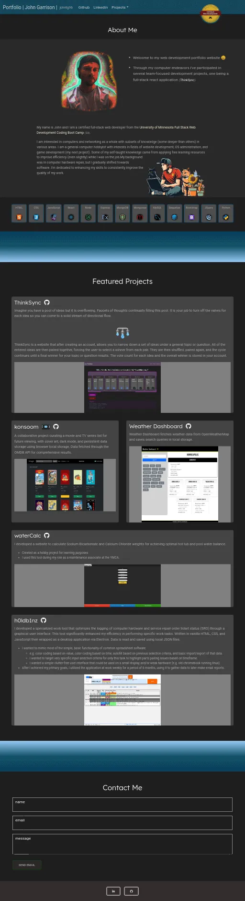

# React.js Portfolio  

## Links  
  

  
* View the live site [here](https://johntg96.com/).
  
* Find me on [LinkedIn](https://www.linkedin.com/in/johntg96/).  

  
  
## Description  
  
This is my web development portfolio website (developed with React.js library).
On it you will find summaries of my web development projects and more information about me as a web developer.

Screenshot:

